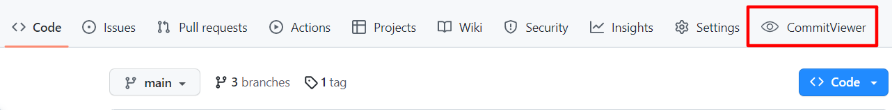
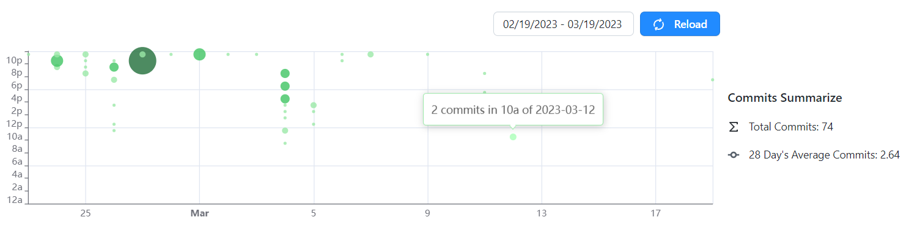
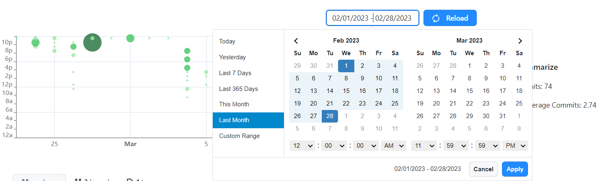

# Chrome插件 - Github Commit Viewer

Github Commit Viewer是一款简单且实用的Chrome插件。它可以帮助您预览Github仓库上commit的提交时间范围，帮助您快速掌握该项目的开发时间，以便您调整迭代计划。

## ⭐ 功能特点

1. **Commit提交预览**：直观预览commit提交时间段分布。
2. **Commit提交总结**：直观的commit提交总结。
3. **可调整时间**：通过简单的时间选择组件，快速切换提交时间段。
4. **使用无负担**：单击一次即可展示，再次点击即可隐藏，完全不影响GitHub日常使用。我们的目标是成为您的助手，绝不是您的负担。
5. **安全隐私**：无需上报任何数据，100%使用安全。

## 🛠 安装使用

1. 打开 [Chrome商店](https://chrome.google.com/webstore) 搜索“Github Commit Viewer”进行安装。
2. 安装完成后，进入任意GitHub仓库页面，即可看到CommitView按钮。

3. 点击CommitViewer按钮，即可看见该仓库提交时间分布，在某个时间点（以小时间隔统计）提交越多，散点覆盖面积越大。右边还有该时间段的简单统计。当再次点击CommitViewer按钮时，可以快速取消图标展示，完全不影响您日常使用GitHub。

4. 通过时间组件，用户可以轻易切换观测时间段，以便掌握不同时间段的提交趋势。

## ❓ 常见问题

1. **使用一段时间后提示输入access token？**

    这是因为Github Commit Viewer使用了Github提供的open api获取您的仓库提交信息，该API有限流策略，频繁使用就会导致您的IP被限流。此时您可以选择过一段时间后再使用，或者输入您的access token，获取更高的限流额度，您可以在👉[该文档](https://docs.github.com/en/authentication/keeping-your-account-and-data-secure/creating-a-personal-access-token)中了解如何创建access token。在此过程中请您放心，access token仅会保存再本地，不会存在任何数据上传。
2. **其它问题？**

    如果您遇到了任何其它问题，请在👉[issue](https://github.com/chubxu/CommitViewer/issues)中提出来，我会尽快支撑以解决。

## 😁 联系我

如您在使用过程中遇到任何问题或有任何建议，欢迎通过以下方式与我取得联系：

- issue：[https://github.com/chubxu/CommitViewer/issues](https://github.com/chubxu/CommitViewer/issues)