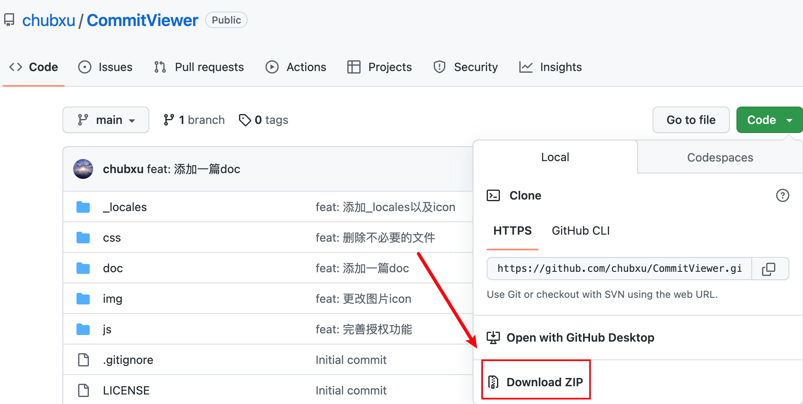

# 🔥🔥Github Commit预览插件上线了，直观掌握你的编码时间

## 1、前言

在当今信息爆炸的互联网时代，Chrome（或其它）浏览器已经成为我们日常生活和工作中必不可少的工具。然而，我们在浏览网页时总会遇到一些不便之处，例如无法找到特定的有效信息、无法直截了当的以统计的视角分析数据，这些问题不仅降低了我们的工作效率，同时还浪费了大量的时间和精力。而Chrome插件往往能够很好的弥补这些专业性质的问题。**不仅能够保留Chrome作为浏览器的最大限度的通用性，还能够提供各种插件去满足不同领域的专业人士的特殊需求。**

## 2、问题背景

不知道大家有没有遇到过这些问题？

想要查看自己某个仓库提交至GitHub上的时间段分布，看看自己花费在这个项目上的大致时间分布情况。

在学习某个大牛的开源项目，想要看看大牛们都是在什么时间段敲代码的。

今天要推荐的这款Chrome插件 - [Github Commit Viewer](https://chrome.google.com/webstore/detail/github-commit-viewer/fgaibjdkhbehoanmgkoiikjklhchodgl?hl=zh-CN)，便能够解决上述问题，它能**帮助开发者直观了解GitHub上某个仓库commit的提交时间段分布**，帮助您更快了解投入在该项目上的时间。

## 3、插件特性介绍

[Github Commit Viewer](https://chrome.google.com/webstore/detail/github-commit-viewer/fgaibjdkhbehoanmgkoiikjklhchodgl?hl=zh-CN)是一款**简单**、**直观**、**开源**、**安全**的一款小而美的Chrome插件，它的目标就是帮助您预览Github仓库上commit的提交时间分布，帮助您快速掌握该项目的开发时间段，以便您调整迭代计划。

**简单**：交互极其简单，整个插件仅有“展示”、“时间选择”两种交互方式，用户不会被繁琐的操作路径所困扰。单击一次即可展示，再次点击即可隐藏，完全不影响GitHub日常使用。我们的目标是成为您的助手，绝不是您的负担。通过简单的时间选择组件，用户可以快速切换commit提交时间段。查看不同时间段的提交时间分布。

**直观**：插件仅有commit分布展示页面，一眼即可收纳所有信息。它允许您直观预览commit提交时间段分布，也具备直观的commit提交总结。

**开源**：[Github Commit Viewer](https://chrome.google.com/webstore/detail/github-commit-viewer/fgaibjdkhbehoanmgkoiikjklhchodgl?hl=zh-CN)插件所有代码都已开源在 👉 [GitHub](https://github.com/chubxu/CommitViewer)上，感兴趣的同学可以点个star哈，想要二次开发的同学也可以积极提交PR，我也会尽快回复的。

**安全**：插件没有任何信息收集，大家可以绝对可以放心使用。

## 4、插件安装与使用

### 4.1、商店安装

如果您能够科学上网，那么就非常方便了。直接进入[Google应用商店](https://chrome.google.com/webstore/category/extensions?hl=zh-CN)，搜索Github Commit Viewer，便可以找到这款插件啦。

当然，由于这款插件刚刚上架Google应用商店，您可能需要翻好几页才能找到🙃，这里贴心的为您准备了直达链接 👉🏻 https://chrome.google.com/webstore/detail/github-commit-viewer/fgaibjdkhbehoanmgkoiikjklhchodgl?hl=zh-CN，然后点击“添加至Chrome”便可以愉快使用啦。

希望大家能够多多安装，多多评价，把插件排名顶高点哈😀。

### 4.2、开发者模式安装

如果您没办法科学上网，那就可以使用这种方法。

1、进入该插件的GitHub主页 *👉🏻 *[*https://github.com/chubxu/CommitViewer*](https://github.com/chubxu/CommitViewer)，把源码下载下来。

2、然后将压缩包解压至任意你喜欢的目录。

3、进入**Chrome管理扩展页面** 👉🏻 chrome://extensions/，激活开发者模式。

4、点击“加载已解压的扩展程序”，选择你刚刚解压的文件夹即可顺利安装了。

### 4.3、使用插件

使用方式也非常简单！！！

1、选择任意一个GitHub仓库，这里我们就选择大名鼎鼎的[elasticsearch](https://github.com/elastic/elasticsearch)了。进入页面后便可以看见多出一个CommitViewer的按钮。

2、点击该按钮，我们便可以看到elasticsearch最近的提交记录啦。大佬们的提交记录还是非常多的。

3、我们也可以自定义时间，看看不同时间段的提交记录。

4、如果我们看够了，再次点击CommitViewer按钮即可取消展示。

是不是十分方便！！！

## 5、未来规划

该插件基本功能已经能够满足我个人的使用了，也比较符合我心中小而美工具的样子。如果还要说有什么不足之处的话，有以下几点：

1、Github的Open API**最多只能获取100个commit**，因此，无论时间范围设置的多大，最多也只能展示最近100个commit分布。后面希望能够解决该问题，可以考虑通过轮训多次，多线程获取等方式获取更多的commit个数。

2、Github的Open API是有限流策略的，**超过一定频率后，将无法访问**。插件当前的做法是让用户手动输入Github提供的Access Token，以获取更大的限流额度。说实话，这种体验比较糟糕，特别对于不了解Access Token的同学来说。后面可能会考虑采取登录授权的方式，会更加友好。

3、当然，**插件目前还需要大家的多多体验才能更加成熟**，大家如果有任何体验上的问题，可以反馈在评论区，或者在GitHub的issue上提出来哈，我也会尽力解决的。
